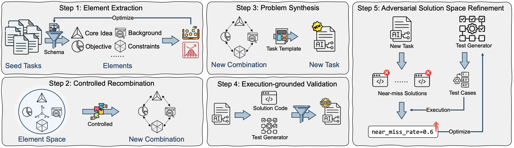
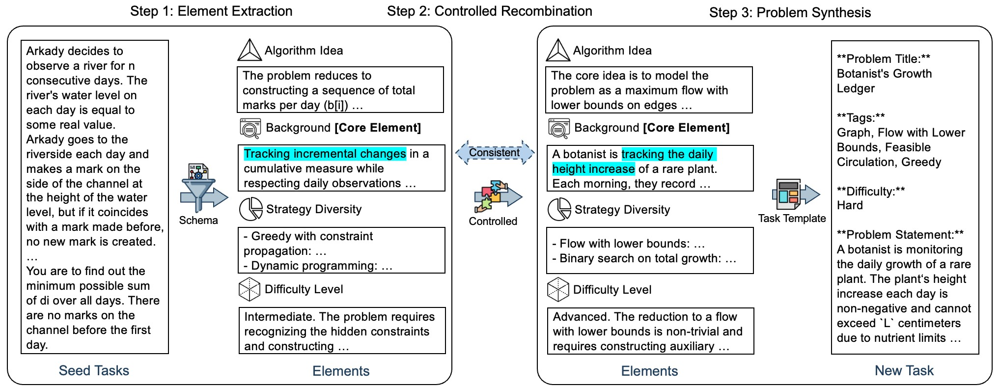

# ADR

<div align="center">

[](https://huggingface.co/datasets/ICIP/ADR)
[](https://arxiv.org/abs/2605.31058)

</div>

Combinatorial Synthesis: Scaling Code RLVR via Atomic Decomposition and Recombination



Reinforcement Learning with Verifiable Rewards (RLVR) has recently emerged as the cornerstone for shaping the remarkable coding abilities of Large Language Models (LLMs).
However, the scalability of RLVR is severely constrained by the scarcity of sufficiently challenging verifiable code tasks that target near the model's edge of competence.
Prior studies often rely on heuristic seed expansions for data synthesis, which severely limits both novelty and difficulty.
Consequently, the training value of such data fails to scale proportionally with the size of its synthesis.
To this end, we propose **A**tomic **D**ecomposition and **R**ecombination (ADR), a novel framework that generates verifiable code tasks via decomposition into atomic elements and controlled recombination, thereby enabling the generation of genuinely novel and challenging verifiable code tasks.
Experiments and analysis demonstrate that ADR achieves superior originality, difficulty, diversity, and test quality over existing baselines, and consistently delivers greater improvements in code ability across RLVR in diverse downstream domains, including algorithmic programming, tool usage, and data science.
Our work sheds light on a new paradigm for novel code task synthesis and scalable RLVR training.

## Paradigm



The pipeline decomposes seed problems into atomic elements, recombines them to form novel frameworks, then synthesizes verifiable tasks with solutions and test cases.

## Installation

```bash
pip install -r requirements.txt
```

## Configuration

| Setting | Environment variable | CLI override | Default |
|---|---|---|---|
| LLM API key | `OPENAI_API_KEY` | `--api_key` | — (required) |
| LLM API base URL | `OPENAI_BASE_URL` | `--base_url` | `https://api.deepseek.com/v1` |
| Sandbox API URL | `SANDBOX_URL` | `--sandbox_url` | — (required for steps 0, 6, 7) |

```bash
export OPENAI_API_KEY=your_api_key_here
export OPENAI_BASE_URL=https://api.deepseek.com/v1   # optional, this is the default
export SANDBOX_URL=http://your-sandbox-api/run        # needed for validation steps
```

Every script's `--help` groups its arguments into **Model & API**, **Sandbox** (where
relevant), **I/O paths**, **Schema** (step 0 only), **Processing**, and **Filtering**.

## Quick start (end-to-end pipeline)

`0_pipeline.py` runs the full synthesis end-to-end (extract → recombine → design →
solve → validate):

```bash
python 0_pipeline.py \
  --seed_data_path /path/to/seed_data.json \
  --output_path ./iter_1/output.json \
  --iter_num iter_1 \
  --sandbox_url http://your-sandbox-api/run
```

### `0_pipeline.py` arguments

| Argument | Group | Required | Default | Description |
|---|---|---|---|---|
| `--model` | Model & API | No | `deepseek-chat` | LLM model identifier. A filename-safe nickname is derived from it (whitespace and illegal characters replaced with `_`) for output naming |
| `--api_key` | Model & API | No | `$OPENAI_API_KEY` | LLM API key |
| `--base_url` | Model & API | No | `$OPENAI_BASE_URL` or `https://api.deepseek.com/v1` | LLM API base URL |
| `--sandbox_url` | Sandbox | Yes* | `$SANDBOX_URL` | Code execution sandbox API URL |
| `--seed_data_path` | I/O | Yes | — | Seed data JSON (list of problem objects) |
| `--output_path` | I/O | Yes | — | Final output JSON path |
| `--iter_num` | I/O | Yes | — | Subdirectory name for intermediate outputs |
| `--schema_path` | Schema | No | `schemas/algorithm.json` | Element schema definition file |
| `--core_element` | Schema | No | first element in schema | Anchor element for Step 2 recombination |
| `--num_samples` | Processing | No | `1` | Samples generated per seed item in Step 2 |
| `--max_workers` | Processing | No | `8` | Parallel worker count |

\* Required, but satisfied by the `SANDBOX_URL` env var if not passed explicitly.

## Running steps individually

The numbered scripts let you run (or re-run) each stage separately. They share the
same Model & API / Sandbox configuration described above.

| Step | Script | Purpose |
|---|---|---|
| 1 | `1_element_schema_optimization.py` | Analyze element entropy & conditional mutual information, then propose schema refinements |
| 2 | `2_extract_elements.py` | Extract atomic elements from seed coding problems |
| 3 | `3_generated_new_elements.py` | Recombine extracted elements into novel element sets |
| 4 | `4_design_task.py` | Design new coding tasks from element sets |
| 5 | `5_generate_solution_test.py` | Generate reference solutions and test-case generators |
| 6 | `6_valid_problem.py` | Validate problems by running solutions against generated tests (sandbox) |
| 7 | `7_adversarial_refinement.py` | Strengthen test-case generators via near-miss adversarial refinement (sandbox) |

Examples:

```bash
# Step 2: extract elements
python 2_extract_elements.py \
  --input_path seeds.json --output_path extracted.json

# Step 6: validate solutions (requires SANDBOX_URL or --sandbox_url)
python 6_valid_problem.py \
  --input_path solutions.json \
  --output_path valid.json \
  --debug_output_path valid_debug.json

# Step 7: adversarial test refinement (requires SANDBOX_URL or --sandbox_url)
python 7_adversarial_refinement.py \
  --input_path valid.json --output_path refined.json
```

Run `python <script>.py --help` for the full, grouped argument list of any step.

### Custom element schema

The default schema (`schemas/algorithm.json`) defines four elements for algorithmic tasks: Core Algorithm Idea, Story Background, Strategy Diversity, and Difficulty Level. Additional domain schemas are available at `schemas/data_science.json` and `schemas/tool_usage.json`. To adapt ADR to a different task domain, create a new schema file:

```json
[
  {"name": "Element A", "definition": "..."},
  {"name": "Element B", "definition": "..."}
]
```

Then pass it via `--schema_path your_schema.json`.

## Repository structure

```
ADR/
├── 0_pipeline.py                      # Full end-to-end pipeline (entry point)
├── 1_element_schema_optimization.py   # Step 1: schema entropy/CMI analysis
├── 2_extract_elements.py              # Step 2: extract atomic elements
├── 3_generated_new_elements.py        # Step 3: recombine elements
├── 4_design_task.py                   # Step 4: design tasks
├── 5_generate_solution_test.py        # Step 5: generate solutions + tests
├── 6_valid_problem.py                 # Step 6: validate via sandbox
├── 7_adversarial_refinement.py        # Step 7: adversarial test refinement
├── requirements.txt                   # Pinned dependencies
├── schemas/
│   ├── algorithm.json                 # Default algorithmic element schema
│   ├── data_science.json              # Data science element schema
│   └── tool_usage.json                # Tool usage element schema
├── utils/                             # Non-synthesis utility clients
│   ├── openai_utils.py                # LLM call helpers (incl. safe_llm_call)
│   └── call_sandbox_api.py            # Sandbox execution client
├── utils_synthetic/                   # Data-synthesis prompts and helpers
│   ├── prompts_synthetic_algorithm.py # Algorithmic prompts + schema/adversarial prompts
│   ├── prompts_synthetic_data_science.py
│   ├── prompts_synthetic_tool_usage.py
│   ├── exec_utils.py                  # Generated-code timeout helper
│   ├── pipeline_utils.py              # Element schema + parsing/validation/IO helpers
│   └── exp_*.py                       # Per-step parsing/prompt-building helpers
└── assets/
```
